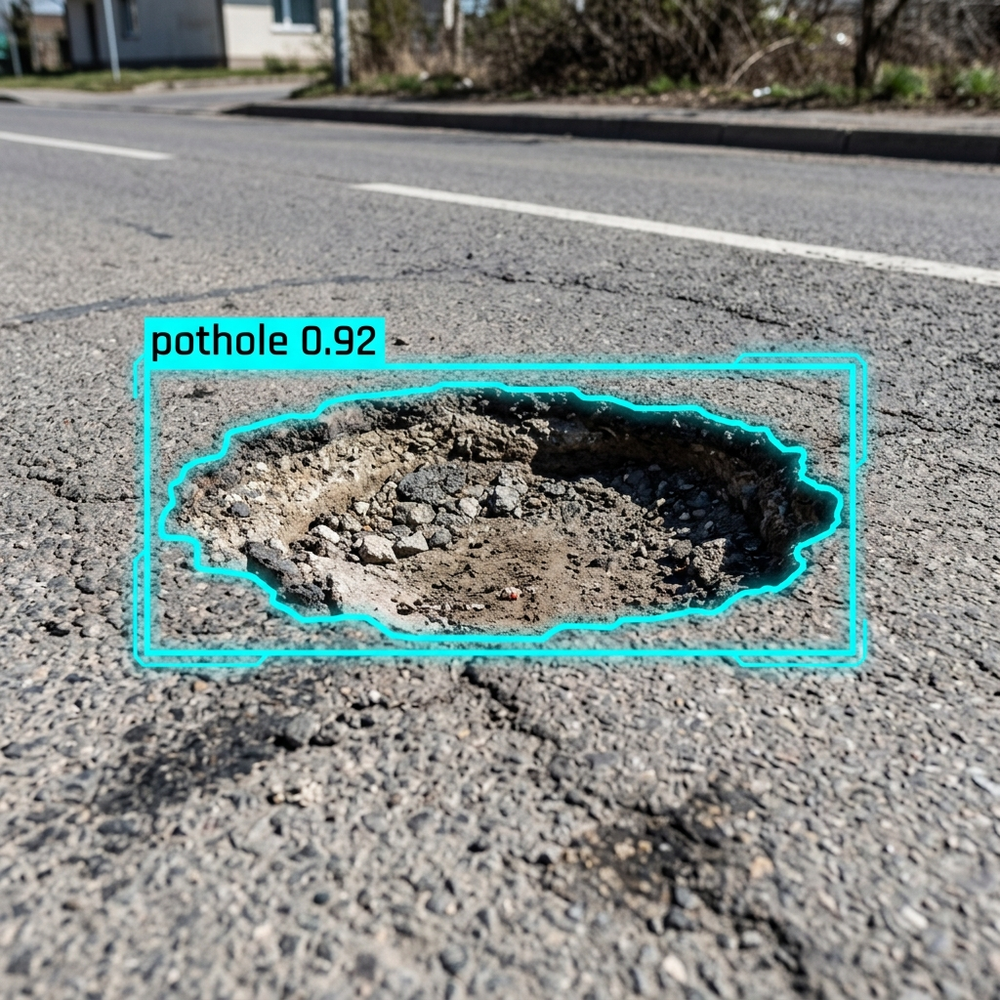

# RoadGuard AI 🛡️

RoadGuard AI is a modern, high-performance, full-stack pothole detection web application built to identify road damage through image analysis. Utilizing a custom-trained YOLO architecture, it allows users to upload street imagery and instantly visualizes detections with precise bounding boxes and confidence scores.



## 🚀 Features

*   **Real-Time Inference:** Lightning-fast backend powered by FastAPI and Ultralytics YOLO.
*   **Custom Object Detection:** Seamlessly loads `sam_detection.pt` for tailored, high-accuracy pothole identification.
*   **Modern UI/UX:** Built with React, Vite, and TailwindCSS, featuring a premium dark-mode aesthetic with glassmorphism styling and deep glowing shadows.
*   **Interactive Dashboard:** Supports drag-and-drop file uploads, dynamic loading states, animated counters, and direct downloads of annotated results.
*   **Smooth Animations:** Powered by Framer Motion for elegant page transitions and micro-interactions.

## 🛠️ Tech Stack

**Frontend:**
*   React 18
*   TypeScript
*   Vite
*   TailwindCSS v3 (Custom UI Components)
*   Framer Motion
*   Lucide React

**Backend:**
*   Python 3
*   FastAPI
*   Ultralytics YOLO
*   OpenCV & Pillow

## 📦 Project Structure

```
RoadGuardAI/
├── backend/                  # FastAPI server & AI Model
│   ├── main.py               # API endpoints & Model loading logic
│   ├── requirements.txt      # Python dependencies
│   └── sam_detection.pt      # Your custom YOLO model file
└── frontend/                 # Vite + React web application
    ├── src/
    │   ├── components/       # Reusable UI components
    │   ├── pages/            # App pages (Landing, Detection)
    │   ├── index.css         # Global styles & Tailwind configs
    │   └── App.tsx           # Main application routing
    └── package.json
```

## ⚙️ Setup & Installation

The project is split into two independent services. Ensure you have Node.js and Python installed on your machine.

### 1. Backend (FastAPI & YOLO)

Navigate to the backend directory and install the requirements:

```bash
cd backend
pip install -r requirements.txt
```

**Important:** Make sure your custom model file (`sam_detection.pt`) is placed inside the `backend/` directory. If it is missing, the backend will safely handle requests without crashing, but will not perform actual object detection.

Start the API server:

```bash
python -m uvicorn main:app --reload --port 8000
```
The API documentation will be available at `http://127.0.0.1:8000/docs`.

### 2. Frontend (React & Vite)

Open a new terminal, navigate to the frontend directory, and install the dependencies:

```bash
cd frontend
npm install
```

Start the Vite development server:

```bash
npm run dev
```
Access the web application at `http://localhost:5173`.

## 👨‍💻 Developer

**Saumya Srivastava**  
*ML Engineer*
